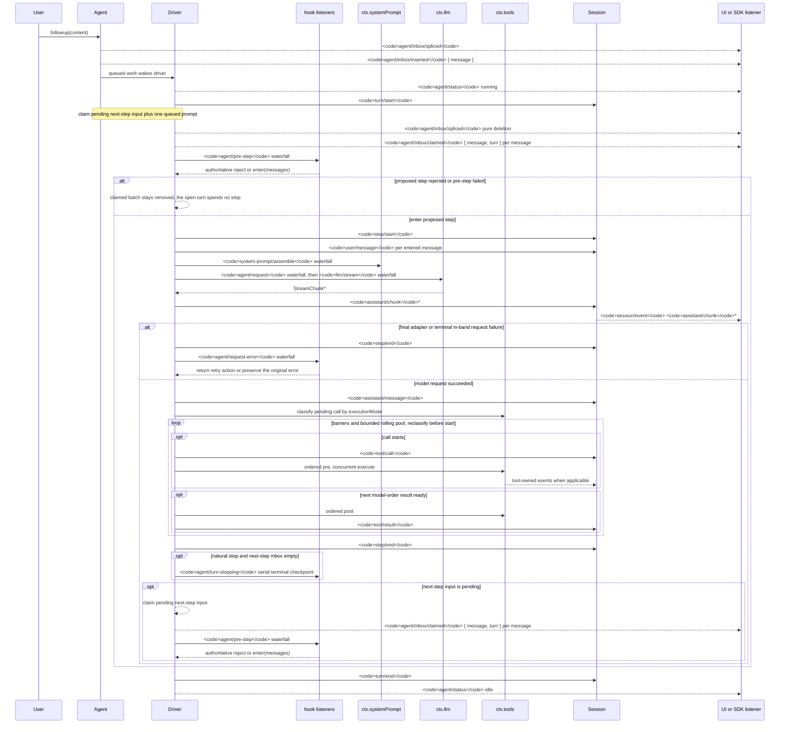

<!-- Английский источник генерируется скриптом scripts/gen-doc-graphs.ts; этот русский файл — сопровождаемая парная сторона.
     При обновлении сначала выполните `pnpm run gen-doc-graphs` для английской стороны, затем обновите этот файл. -->

# Жизненный цикл хода и шага агента

[English](agent-lifecycle.md) | [中文](agent-lifecycle.zh.md) | Русский

Эта диаграмма последовательности — визуальный компаньон [документа об архитектуре](architecture.ru.md#поток-хода). Долговременные факты воспроизведения она держит на `session/event`, живые управление и статус — на `agent/*`.

Событие `assistant/message` записывает каждый успешный вызов провайдера, включая завершения без содержимого и по причине `max-tokens`. Пустое содержимое остаётся вне производной истории, тогда как долговременное событие хранит расход токенов и `sourceEventSeqs` со списком точных событий `assistant/chunk`, включая явный пустой список.

`dsh-compaction-basic` использует `agent/pre-step` для давления до вывода запроса и `agent/request-error` — только для канонического переполнения контекста. Как только один из триггеров срабатывает, перед выбором резюме выполняется необязательная обрезка результатов инструментов. Восстановление работает между закрытым отказавшим шагом и закрытием отказавшего хода и открывает свежий ход повторной попытки, только когда обрезка или суммаризация продвигает поколение замены поверхности; иначе первоначальная ошибка запроса остаётся авторитетной.

Возвращённое решение `agent/pre-step` авторитетно; слушатели, оборачивающие `next()`, сохраняют нижележащие сообщения, если замена не была намеренной. Steering (корректировка хода диалога) и внедрённый контекст проходят тот же каскад после того, как более поздняя операция клеймления забирает их батч следующего шага.

Пользователям SDK, которым нужны воспроизводимые данные транскрипта, следует потреблять `session/event`; `agent/*` — живой координационный API для очереди и статуса, перехвата промпта, построения запроса, steering, продолжения и ошибок.

Режим сопровождения: курируемая Mermaid-последовательность; точные сигнатуры событий живут в сгенерированном каталоге Cordis.
