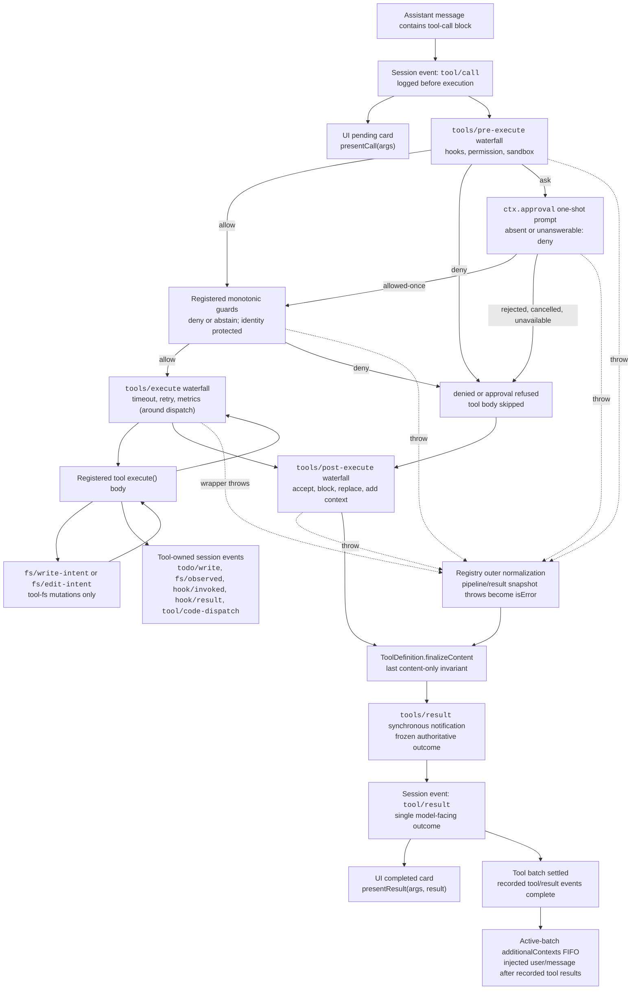

<!-- Английский источник генерируется скриптом scripts/gen-doc-graphs.ts; этот русский файл — сопровождаемая парная сторона.
     При обновлении сначала выполните `pnpm run gen-doc-graphs` для английской стороны, затем обновите этот файл. -->

# Пайплайн исполнения инструментов

[English](tool-execution-pipeline.md) | [中文](tool-execution-pipeline.zh.md) | Русский

Этот граф показывает, где исполняются политика, хуки, песочница, guard'ы файловой системы, перезапись результата, наблюдение итогового исхода и рендеринг UI — без изменения цикла. Первым запускается каскад `tools/pre-execute`, следом — монотонные guard'ы, затем каскады `tools/execute` и `tools/post-execute`; эти три каскада могут преобразовать вызов. После них исполняются принадлежащие определению `finalizeContent` и `tools/result`.

Проверки чтения перед правкой в файловой системе остаются ниже `tool-fs`, на событиях `fs/*`. Обобщённые каскады pre/post — место для хуков и политики одобрения; `ctx.approval` обрабатывает запросы на одобрение до монотонных guard'ов, а политика владельца, которую нельзя переупорядочивать, остаётся зарегистрированным guard'ом. Задачи around-диспетчеризации, такие как таймауты, оборачивают `tools/execute`. Реестр выполняет снапшот результата-кандидата без потерь и нормализует сбой снапшота до того, как колбэк `finalizeContent` видимого определения на основе снапшота обеспечит свой синхронный content-only инвариант. Затем `tools/result` наблюдает неизменяемый исход в формате lossless-JSON. Это позволяет хукам охватывать семейства инструментов, не привязывая инструменты к одному сервису политики. Code Mode проводит через пайплайн как зарезервированный транспорт `run_code`, так и его сериализованные подвызовы; подвызовы несут токен родителя, логируют `tool/code-dispatch`, возвращают отказы как binding rejections и опускают `additionalContexts`, чтобы сохранить смежность вызова и результата.

Режим сопровождения: курируемый Mermaid-граф; точные схемы инструментов и сигнатуры событий приведены в сгенерированных каталогах.
